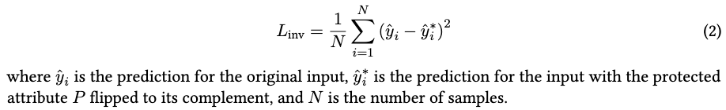
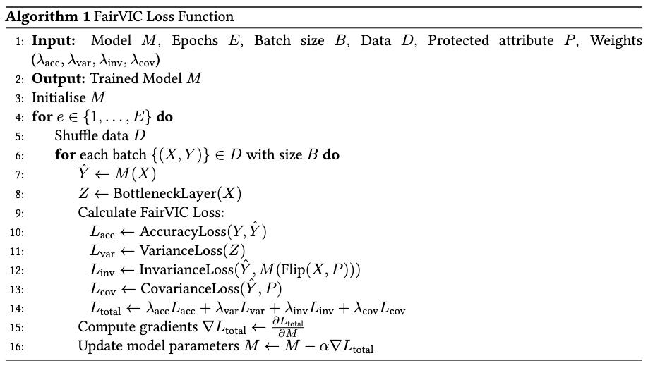

# FairVIC
This repository contains code from my paper on **Fairness** through **V**ariance, **I**nvariance, and **C**ovariance.

### Introduction
In the fast-evolving field of Artificial Intelligence (AI), Neural Networks (NNs) have become crucial in Automated Decision Making (ADM) systems across various industries such as healthcare, finance, and recruitment. These models, however, often inherit biases from their training datasets, which can lead to unfair decisions adversely affecting individuals—especially noted in cases like facial recognition technologies where biases can lead to discrimination in law enforcement and hiring.

Addressing these biases presents complex challenges, notably due to the opaque nature of these AI models and the dynamic and nuanced nature of data and fairness definitions. This complexity makes it hard to detect and correct biases, requiring sophisticated approaches to develop inherently fair algorithms.

We introduce **FairVIC**, **Fair**ness through **V**ariance, **I**nvariance, and **C**ovariance, a novel approach that directly incorporates fairness into neural networks by optimizing a custom loss function designed to minimise bias. This function reduces the correlation between decisions and protected characteristics while maximizing prediction performance.

  

Fig 1. A high-level overview of the FairVIC loss function in a neural network training loop.

FairVIC is distinctive because it integrates fairness concepts during the training process itself, making it less intrusive and more adaptable to various datasets and fairness definitions. Our experiments show that FairVIC significantly improves fairness metrics without compromising prediction accuracy, demonstrating robust performance compared to other state-of-the-art bias mitigation techniques.

Our contributions are as follows:
- A novel in-processing bias mitigation technique for neural networks.
- A comprehensive evaluation of FairVIC against other leading methods, demonstrating superior performance on a variety of metrics.
- An in-depth analysis of the robustness of our proposed method.

### FairVIC
In our paper we propose FairVIC, a novel loss function that enables a model’s ability to learn fairness in a robust manner. FairVIC is comprised of three new terms: variance, invariance, and covariance. Minimising for these three terms encourages the model to be stable and consistent across protected characteristics, therefore reducing bias during training. By adopting this broad, generalized approach to defining bias, FairVIC significantly improves performance across a range of fairness metrics. The three loss terms are defined as:

  

Eq 1. Variance loss term equation.

  

Eq 2. Invariance loss term equation.

  

Eq 3. Covariance loss term equation.

For details on implementation these terms within the model's training loop, see Alg 1 below.

  

Alg 1. FairVIC loss function.

### Getting Started
All of the code and packages necessary to implement FairVIC are contained within a tutorial Jupyter Notebook in this repository. This notebook will guide you step by step into using FairVIC in a standard neural network. We encourage you to tweak parameters, weights, and models to highlight the power of FairVIC.

### Files
This repository contains the following files:
* `AdultFairVICSupplementaryCode.ipynb` - A detailed Jupyter Notebook that will guide readers through using FairVIC.
* `Images` - Contains all the images used in this repo.

### Datasets
We evaluate FairVIC in our paper on three tabular and one text datasets that are used in bias mitigation evaluation due to their known biases towards certain subgroups of people within their sample population. These datasets allow for highlighting the generalisable capabilities of FairVIC across different demographic disparities.

Dataset 1: [Adult Income](https://archive.ics.uci.edu/dataset/2/adult).
This is the primary dataset we use for our evaluation. The classification task is to predict whether an individual's income is >$50K or ≤$50K. It is particularly known for its gender and racial biases in economic disparity.

Dataset 2: [COMPAS](https://www.propublica.org/datastore/dataset/compas-recidivism-risk-score-data-and-analysis).
The Correctional Offender Management Profiling for Alternative Sanctions (COMPAS) dataset is frequently used for evaluating debiasing techniques. It has a classification goal of predicting recidivism risks and is infamous for its racial biases.

Dataset 3: [German Credit](https://archive.ics.uci.edu/dataset/144/statlog+german+credit+data). 
This final tabulae dataset is used to assess creditworthiness by classification of individuals into bad or good credit risks, with known biases related to age and gender. 

Dataset 4 (Text): [CivilComments-WILDS](https://huggingface.co/datasets/shlomihod/civil-comments-wilds).
This natural language dataset is comprised of a collection of comments on the Civil Comments platform. The binary classification goal is to label comments as toxic or non-toxic.

Dataset 5 (Text): [BiasBios]([https://huggingface.co/datasets/shlomihod/civil-comments-wilds](https://huggingface.co/datasets/LabHC/bias_in_bios)).
This natural language dataset consists of short biographies labelled with profession and gender. We take architect, attorney, dentist, physician, professor, software engineer, surgeon as the favourable professions, and interior designer, journalist, model, nurse, poet, teacher, and yoga teacher as the unfavourable professions for our binary classification task.

Metadata for each of the three datasets can be seen below:
| Dataset                  | Adult        | COMPAS           | German        | CivilComments - WILDS | Bias Bios        |
| -------------            | ------------ | -------------    | ------------- | -------------         | Text             |
| No. of Features          | 11           | 8                | 20            | 52                    | 52               |
| No. of Rows              | 48,842       | 5,278            | 1,000         | 50,000                | 50,000           |
| Target Variable          | income       | two_year_recid   | credit        | toxicity              | profession       |
| Favourable Label         | >50K (1)     | False (0)        | Good (1)      | Non-Toxic (0)         | Favourable (1)   |
| Unfavourable Label       | <=50K (0)    | True (1)         | Bad (0)       | Toxic (1)             | Unfavourable (0) |
| Protected Characteristic | sex          | race             | age           | race                  | gender           |
| Privileged Group         | male (1)     | Caucasian        | >25 (1)       | white (1)             | Male (0)         |
| Unprivileged Group       | female (0)   | African-American | <=25 (0)      | non-white (0)         | Female (1)       |
